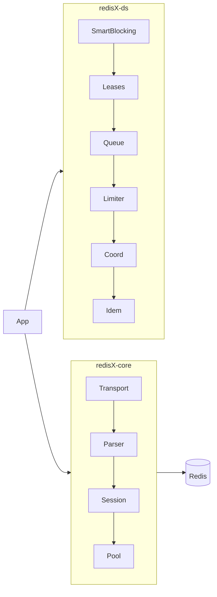

# 🧠 **redisX — The Redis Client Reinvented**

 

> **Type-safe • Distributed • Intent-driven**
>
> A **RESP3-native, high-performance, TypeScript Redis client** engineered for modern distributed systems — with first-class primitives for **leases, rate limiting, queues, smart blocking, and idempotency**.
>
> Built to make **Redis feel human**, and distributed coordination **feel effortless**.

---

## ✨ Philosophy

> *Rebuild to understand. Reinvent to enlighten.*

Traditional Redis clients (like `ioredis` or `node-redis`) focus on connectivity and command execution.
**redisX** goes further — it treats Redis as a *distributed runtime* and builds primitives that encode **intent, safety, and cognition**.

* **Rebuild cleanly:** a zero-copy RESP3 core with async-iterator semantics.
* **Reinvent functionally:** every API is type-safe, cancelable, and composable.
* **Elevate cognitively:** expose primitives (leases, queues, coalescers) that simplify complex distributed behaviors.

---

## 🧩 Architecture Overview



**Core Layers**

* **Transport:** TCP/TLS/WebSocket with backpressure.
* **Parser:** RESP3 streaming, zero-copy decoding.
* **Session:** Command correlation and deadlines.
* **Pool:** Connection health, jittered reconnects.

**DS Pack**

* SmartBlocking™ waits and coalesced notifications.
* Safe leases with fencing tokens.
* Stream-based queues and rate limiters.
* Idempotency and coalescers for singleflight.
* Leader election, barriers, playbooks.

---

## ⚙️ Installation

```bash
npm install redisx
# or
pnpm add redisx
```

---

## 🚀 Quick Start

```ts
import { redisX, createDS } from "redisx";

const client = await redisX.connect({ host: "127.0.0.1", port: 6379 });
client.ds = createDS(client);

// Basic
await client.set("foo", "bar");
console.log(await client.get("foo"));

// Pipeline
const p = client.pipeline();
p.SET("a", "1"); p.INCR("a");
console.log(await p.exec());

// SmartBlocking
await client.ds.smart.waitFor("job:42:status", { predicate: v => v === "done", budgetMs: 15_000 });

// Lease with fencing
const lease = await client.ds.lease.acquire("video:42", { ttlMs: 8000, owner: "node-A" });
if (lease.ok) {
  await using _ = lease.autoRenew();
  await processJob(lease.token);
}

// Queue (streams)
const q = client.ds.queue.stream("email:queue", { vtMs: 30000 });
await q.enqueue({ to: "max@redisx.dev", subject: "Welcome" });
for await (const job of q.consume({ group: "mailer", consumer: "worker-1" })) {
  await sendEmail(job.data);
  await job.ack();
}
```

---

## 🪄 Magic Layer (Intent API)

Turn complex workflows into one-liners.

```ts
// Cache-aside with stampede protection
const user = await client.intent.getOrCompute(
  `user:${id}`,
  { ttlMs: 60_000 },
  () => fetchUser(id)
);

// Rate limiting
await client.intent.rateLimit("api:/users", { rate: "100/m", burst: 20 });

// LeaseLock
await client.intent.leaseLock("file:upload", async () => {
  await uploadLargeFile();
});
```

**Principle:**

> *You describe intent. redisX chooses the optimal Redis pattern.*

---

## 🧱 Core Modules

| Module               | Purpose                                   | Example                     |
| -------------------- | ----------------------------------------- | --------------------------- |
| **Transport**        | TCP/TLS/WebSocket, backpressure safe      | `redisX.connect()`          |
| **Parser**           | RESP3 decode/encode                       | `resp3.decode(bytes)`       |
| **Session**          | Command multiplexing, deadlines           | `client.cmd("GET", "key")`  |
| **Pool**             | Connection management                     | `client.withSession()`      |
| **SmartBlocking**    | Efficient waits across keys/lists/streams | `client.ds.smart.waitFor()` |
| **Leases**           | Renewable distributed ownership           | `client.ds.lease.acquire()` |
| **Queues**           | Stream-based work queues                  | `client.ds.queue.stream()`  |
| **Limiter**          | GCRA, semaphore, concurrency              | `client.ds.limiter.gcra()`  |
| **Idem / Coalescer** | Idempotent run / singleflight             | `client.ds.idem.run()`      |
| **Coordination**     | Leader election, barrier, latch           | `client.ds.coord.leader()`  |

---

## 📈 Telemetry

All primitives emit **RED metrics** and **OpenTelemetry traces**.

| Metric                     | Labels            | Description         |
| -------------------------- | ----------------- | ------------------- |
| `redisx_ds_requests_total` | primitive, op     | Total DS operations |
| `redisx_ds_duration_ms`    | primitive         | Duration histogram  |
| `redisx_ds_errors_total`   | primitive, reason | Error count         |

Trace attributes:
`redisx.primitive`, `keyspace`, `owner`, `token`, `group`, `stream`.

---

## 🧪 Testing & Benchmarks

```bash
# Run unit tests and Lua property tests
pnpm test

# Chaos suite (requires Docker + toxiproxy)
pnpm test:chaos

# Benchmark latency
pnpm bench
```

**Targets**

* Parser throughput: > 5M msgs/sec on Node 20
* Client overhead: < 3ms p99 local
* Queue visibility latency: < 200ms

---

## 🧭 Roadmap

| Phase | Goal                                         | Status |
| ----- | -------------------------------------------- | ------ |
| 0     | RESP3 parser, encoder, testkit               | ✅      |
| 1     | Core client (connect, session, pipeline)     | ✅      |
| 2     | Reliability (pool, retry, telemetry)         | 🟡     |
| 3     | Developer delight (typed commands)           | 🟡     |
| 4     | DS Pack (leases, limiter, queue, idem)       | 🟢     |
| 5     | Magic Layer ✨ (intents, playbooks, AI types) | 🟣     |
| 6     | Cluster + Sentinel auto-topology             | 🔜     |

---

## 📚 Design Principles

1. **No hidden retries.**
   Only idempotent commands retry automatically.
2. **Server time > local time.**
   All TTL and rate math use Redis `TIME`.
3. **Deterministic async.**
   Every op can be canceled; no unbounded promises.
4. **Backpressure always.**
   Async generators for all streams.
5. **Truth at the boundary.**
   Derive types and semantics directly from Redis responses.

---

## 💡 Example: Build Distributed Rate Limiter

```ts
const rl = client.ds.limiter.gcra("api:checkout", { rate: "50/s", burst: 100 });
if (!rl.allowed) {
  return res.status(429).send(`Retry after ${rl.retryInMs}ms`);
}
processCheckout();
```

---

## 🧬 Project Structure

```
packages/
  redisx-core/      # core protocol + transport
  redisx-ds/        # distributed primitives
  redisx-testkit/   # chaos + property tests
  redisx-cli/       # optional playground / inspector
docs/
  design/
  guides/
bench/
```

---

## 🔬 Philosophy in One Line

> **redisX** isn’t just a client — it’s a *distributed-systems SDK for Redis.*

You don’t send commands.
You express **intent**, and redisX orchestrates correctness, performance, and safety.

---

## 🧠 X100 Vision

* **Self-healing topology:** Auto-learn cluster maps and latency routes.
* **Type Deriver:** Generate TS types from Redis COMMAND DOCS.
* **Playbook Engine:** Declarative workflows on top of primitives.
* **Live REPL + Dashboard:** Visualize RESP, latency, and DS state in real time.
* **Multi-runtime SDK:** Works across Node, Bun, Deno.
* **Philosophical goal:** Make distributed cognition simple, not scary.

---

## 🤝 Contributing

Pull requests welcome.
Please include:

* Unit + chaos tests.
* Type-safe APIs.
* Docs under `/docs/design/`.

---

## ⚖️ License

Apache 2.0 © redisX Authors
