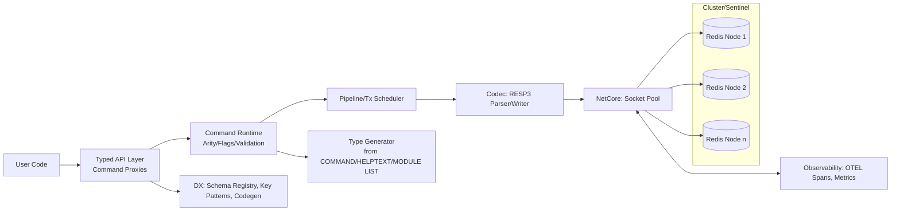

## Overall Architecture

```mermaid
flowchart LR
  A[User Code] --> B[Typed API Layer<br/>Command Proxies]
  B --> C[Command Runtime<br/>Arity/Flags/Validation]
  C --> D[Pipeline/Tx Scheduler]
  D --> E[Codec: RESP3 Parser/Writer]
  E --> F[NetCore: Socket Pool]
  F --> G[(Redis Node 1)]
  F --> H[(Redis Node 2)]
  F --> I[(Redis Node n)]
  subgraph Cluster/Sentinel
  G
  H
  I
  end
  C --> J[Type Generator<br/>from COMMAND/HELPTEXT/MODULE LIST]
  B --> K[DX: Schema Registry, Key Patterns, Codegen]
  F <---> L[Observability: OTEL Spans, Metrics]

```