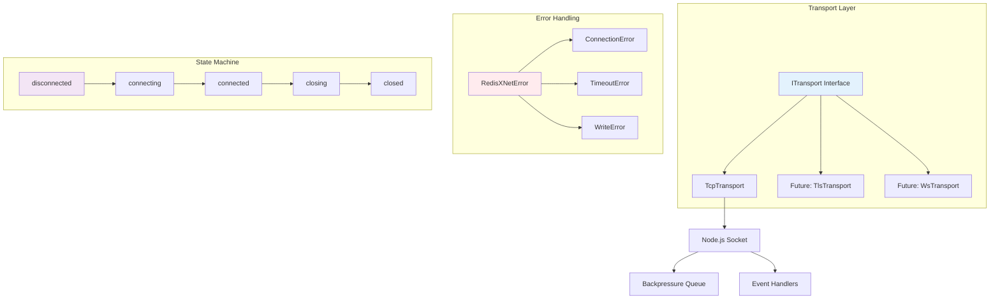
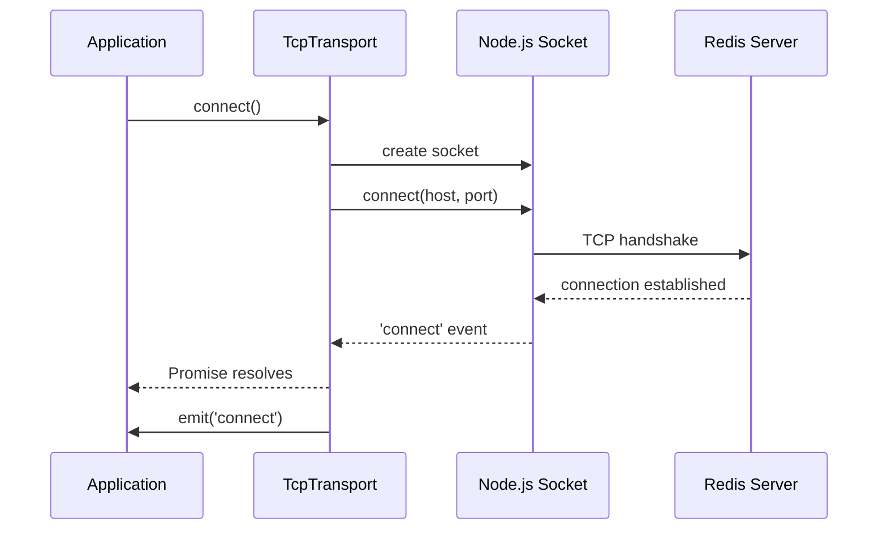
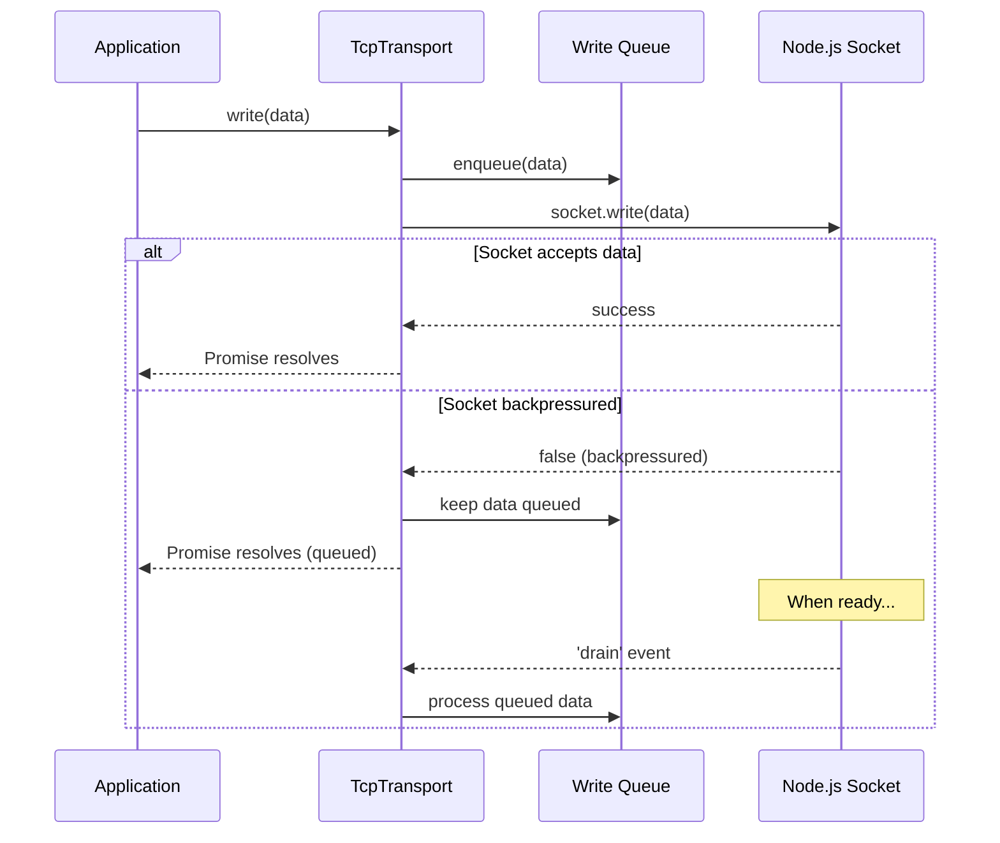
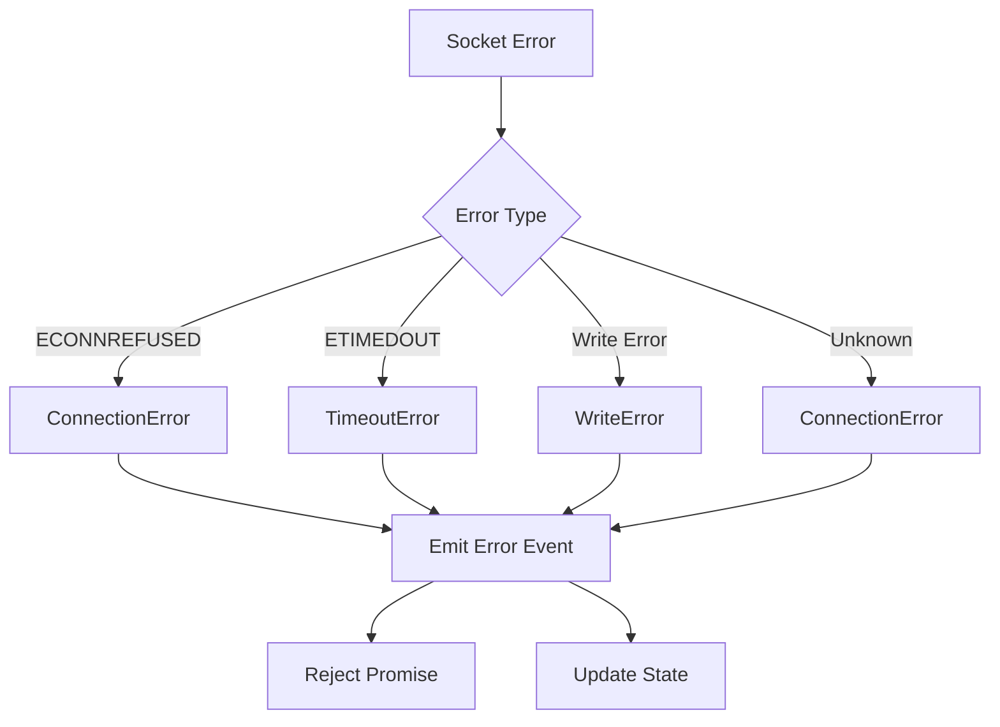

# Net Module Architecture

## Overview

The `net` module provides the foundational transport layer for redisX, handling low-level network communication with Redis servers. It implements a clean abstraction over TCP sockets with proper lifecycle management, backpressure handling, and typed error reporting.

## Design Principles

1. **Transport Abstraction**: Clean interface that can be implemented by different transport types (TCP, TLS, WebSocket)
2. **Backpressure Awareness**: Respects socket write buffer limits and queues data appropriately
3. **Typed Error Handling**: Comprehensive error taxonomy for different failure modes
4. **Lifecycle Management**: Clear state transitions with proper cleanup
5. **Event-Driven**: Both promise-based operations and event-based notifications

## Architecture



## Core Components

### 1. Transport Interface (`transport.ts`)

Defines the contract that all transport implementations must follow:

```typescript
interface ITransport extends EventEmitter {
  readonly state: TransportState;
  readonly address: string;
  
  connect(): Promise<void>;
  write(data: Buffer): Promise<void>;
  close(): Promise<void>;
}
```

**Key Features:**
- **State Management**: Clear connection states with type safety
- **Promise-based Operations**: Async/await friendly API
- **Event Emission**: Lifecycle and data events for reactive programming
- **Address Information**: Human-readable connection details for logging

### 2. TCP Transport (`tcp-transport.ts`)

Concrete implementation using Node.js `net.Socket`:

**State Machine:**
```
disconnected → connecting → connected → closing → closed
```

**Backpressure Handling:**
1. Check `socket.write()` return value
2. Queue data if socket is backpressured
3. Process queue on 'drain' event
4. Handle write errors gracefully

**Connection Management:**
- Configurable connection timeout
- Automatic error mapping from Node.js errors
- Graceful close with pending write cleanup
- Event handler setup and teardown

### 3. Error Hierarchy (`errors.ts`)

Typed error system for different failure modes:

```typescript
RedisXNetError (base)
├── ConnectionError (ECONNREFUSED, ECONNRESET, etc.)
├── TimeoutError (connection/write timeouts)
└── WriteError (write failures, backpressure)
```

**Error Codes:**
- `CONNECTION_REFUSED`: Remote host rejected connection
- `CONNECTION_TIMEOUT`: Connection attempt timed out
- `CONNECTION_CLOSED`: Connection closed unexpectedly
- `WRITE_FAILED`: Write operation failed
- `INVALID_STATE`: Operation not allowed in current state

## Data Flow

### Connection Flow



### Write Flow with Backpressure



### Error Handling Flow



## Usage Examples

### Basic Connection

```typescript
import { TcpTransport } from './net';

const transport = new TcpTransport({
  host: 'localhost',
  port: 6379,
  connectTimeout: 5000
});

// Connect
await transport.connect();
console.log('Connected to:', transport.address);

// Write data
await transport.write(Buffer.from('PING\r\n'));

// Handle responses
transport.on('data', (event) => {
  console.log('Received:', event.data.toString());
});

// Close when done
await transport.close();
```

### Error Handling

```typescript
import { TcpTransport, ConnectionError, TimeoutError } from './net';

const transport = new TcpTransport({
  host: 'localhost',
  port: 6379
});

try {
  await transport.connect();
} catch (error) {
  if (error instanceof ConnectionError) {
    console.error('Connection failed:', error.message);
  } else if (error instanceof TimeoutError) {
    console.error('Connection timeout:', error.timeoutMs);
  }
}

// Event-based error handling
transport.on('error', (event) => {
  console.error('Transport error:', event.error.message);
  console.error('Error code:', event.code);
});
```

### Backpressure Handling

```typescript
// The transport automatically handles backpressure
const largeData = Buffer.alloc(1024 * 1024); // 1MB

// This will queue if socket is backpressured
await transport.write(largeData);

// Multiple writes are queued and processed in order
await transport.write(Buffer.from('command1\r\n'));
await transport.write(Buffer.from('command2\r\n'));
await transport.write(Buffer.from('command3\r\n'));

// All writes will complete when socket is ready
```

## Performance Considerations

### Memory Management

- **Buffer Reuse**: Minimal buffer allocations during normal operation
- **Queue Management**: Efficient write queue with minimal overhead
- **Event Cleanup**: Proper listener removal to prevent memory leaks

### Backpressure Strategy

- **Write Queuing**: Data is queued when socket is backpressured
- **Drain Processing**: Queue is processed when socket becomes writable
- **Error Propagation**: Write errors are properly propagated to application

### Connection Overhead

- **Single Socket**: One TCP connection per transport instance
- **Event Handlers**: Minimal event listener setup
- **State Tracking**: Lightweight state machine with no polling

## Testing Strategy

### Unit Tests

- **State Transitions**: Verify correct state machine behavior
- **Error Mapping**: Test Node.js error to RedisX error mapping
- **Backpressure**: Simulate backpressure scenarios
- **Timeout Handling**: Test connection and operation timeouts

### Integration Tests

- **Real TCP Server**: Use Node.js `net.createServer()` for realistic testing
- **Error Scenarios**: Test connection refused, timeouts, network errors
- **Data Flow**: Verify bidirectional data transmission
- **Concurrent Operations**: Test multiple writes and connection states

### Test Coverage

- ✅ Connection lifecycle (connect, close, error)
- ✅ Data transmission (write, read, backpressure)
- ✅ Error handling (timeouts, connection failures)
- ✅ State management (transitions, validation)
- ✅ Event emission (data, error, lifecycle events)

## Future Enhancements

### Phase 1: TLS Support

```typescript
class TlsTransport implements ITransport {
  // TLS implementation with certificate validation
  // SNI support, cipher suite configuration
}
```

### Phase 2: WebSocket Transport

```typescript
class WsTransport implements ITransport {
  // WebSocket implementation for browser environments
  // Subprotocol negotiation, ping/pong handling
}
```

### Phase 3: Connection Pooling

```typescript
class TransportPool {
  // Connection pooling with health checks
  // Load balancing, failover, connection limits
}
```

## Integration Points

### With Parser/Writer

The net module provides raw data streams that can be consumed by the parser/writer layer:

```typescript
// Future integration example
const transport = new TcpTransport(options);
const parser = new Resp3Parser();
const writer = new Resp3Writer();

transport.on('data', (event) => {
  parser.feed(event.data);
});

// Send commands
const command = writer.encodeCommand('GET', 'key');
await transport.write(command);
```

### With Session Layer

The transport provides the foundation for command correlation and session management:

```typescript
// Future session integration
class Session {
  constructor(private transport: ITransport) {}
  
  async execute(command: string, ...args: any[]): Promise<any> {
    // Send command, correlate response
  }
}
```

## Error Recovery

### Connection Errors

- **Automatic Cleanup**: Socket and event handlers are properly cleaned up
- **State Reset**: Transport returns to disconnected state on error
- **Error Propagation**: All errors are surfaced to application layer

### Write Errors

- **Queue Preservation**: Pending writes are preserved during reconnection
- **Error Isolation**: Write errors don't affect connection state
- **Retry Logic**: Application can implement retry strategies

## Monitoring and Observability

### Events for Monitoring

- **Connection Events**: `connect`, `close` for connection lifecycle
- **Data Events**: `data` with timestamps for performance monitoring
- **Error Events**: `error` with structured error information

### Metrics Collection

```typescript
// Example metrics collection
transport.on('data', (event) => {
  metrics.recordDataReceived(event.data.length);
});

transport.on('error', (event) => {
  metrics.recordError(event.code);
});
```

## Conclusion

The net module provides a solid foundation for Redis communication with:

- **Clean Abstractions**: Easy to test and extend
- **Robust Error Handling**: Comprehensive error taxonomy
- **Performance Focus**: Efficient backpressure and memory management
- **Future-Proof**: Ready for TLS, WebSocket, and pooling extensions

This transport layer enables higher-level components to focus on protocol logic rather than network concerns, following the redisX principle of clean separation of concerns.
