# RESP3 Parser/Writer Architecture

## Overview

The `parser_writer` module is the core protocol implementation for the redisX Redis client, providing complete RESP3 (Redis Serialization Protocol version 3) support. This module handles the bidirectional conversion between JavaScript/TypeScript values and the RESP3 wire format used by Redis servers.

## Table of Contents

1. [Architecture Overview](#architecture-overview)
2. [Core Components](#core-components)
3. [RESP3 Protocol Support](#resp3-protocol-support)
4. [Parser Architecture](#parser-architecture)
5. [Writer Architecture](#writer-architecture)
6. [Data Flow](#data-flow)
7. [Memory Management](#memory-management)
8. [Error Handling](#error-handling)
9. [Performance Considerations](#performance-considerations)
10. [Testing Strategy](#testing-strategy)

## Architecture Overview

The parser_writer module follows a clean separation of concerns with two main components:

- **Parser**: Converts RESP3 wire format to typed JavaScript objects
- **Writer**: Converts JavaScript objects to RESP3 wire format

Both components are designed for high performance, memory efficiency, and type safety.

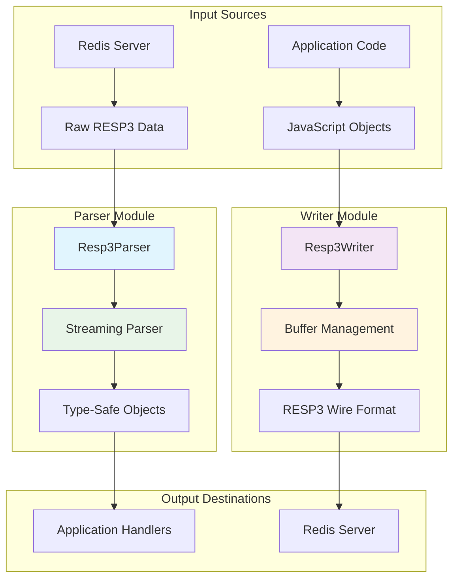

## Core Components

### Module Structure

```
parser_writer/
├── index.ts          # Public API exports
├── parser.ts         # RESP3 parser implementation
├── writer.ts         # RESP3 writer implementation
└── __tests__/        # Comprehensive test suite
    ├── parser.spec.ts
    └── writer.spec.ts
```

### Public API

```typescript
// Main exports
export { Resp3Parser, type ParserOptions, type Resp3 } from './parser';
export { Resp3Writer, type WriterOptions } from './writer';

// Type definitions
export type { Resp3Attributes, IResp3Parser, IResp3Writer };
```

## RESP3 Protocol Support

The module implements the complete RESP3 specification with support for all data types:

### Supported Data Types

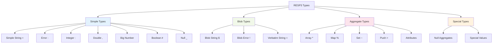

### Type System

The module uses a discriminated union type system for type safety:

```typescript
export type Resp3 =
    | Resp3SimpleString
    | Resp3Error
    | Resp3Integer
    | Resp3Double
    | Resp3BigNumber
    | Resp3Boolean
    | Resp3Null
    | Resp3BlobString
    | Resp3BlobError
    | Resp3VerbatimString
    | Resp3Array
    | Resp3Map
    | Resp3Set
    | Resp3Push;
```

## Parser Architecture

### Core Design Principles

1. **Streaming**: Handles partial data gracefully
2. **Memory Efficient**: Minimal buffer allocations
3. **Type Safe**: Strong typing for all RESP3 types
4. **Error Resilient**: Recovers from malformed data
5. **Backpressure Aware**: Respects flow control

### Parser State Machine

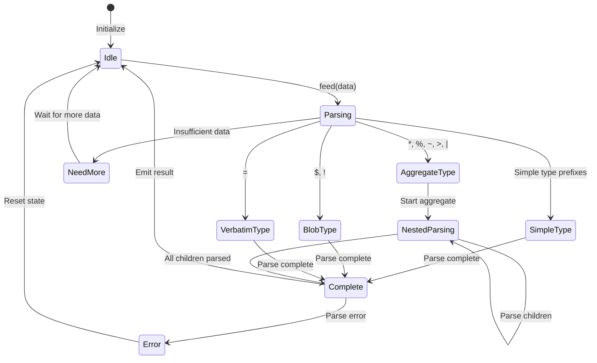

### Parser Components

#### 1. Buffer Management

```typescript
class Resp3Parser {
    private _buffer: Buffer = Buffer.alloc(0);
    private _offset: number = 0;
    private _frames: Frame[] = [];
    private _pendingAttributes: Resp3Attributes | undefined;
}
```

**Key Features:**
- **Incremental Buffer Growth**: Only allocates what's needed
- **Offset Tracking**: Efficiently tracks consumed data
- **Frame Stack**: Manages nested aggregate parsing
- **Attribute Handling**: Tracks pending attributes for decoration

#### 2. Streaming Parser

The parser uses a streaming approach that can handle partial data:

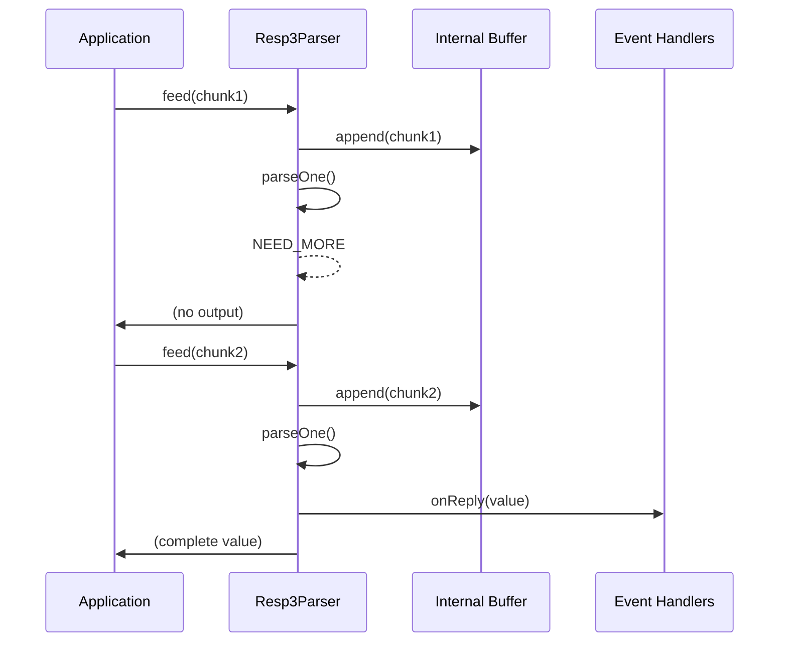

#### 3. Aggregate Parsing

Complex nested structures are handled using a frame-based approach:

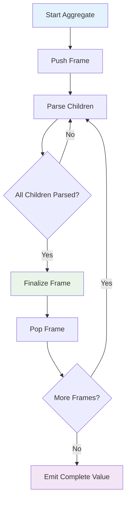

#### 4. Attribute Handling

Attributes in RESP3 are special aggregates that decorate the next value:

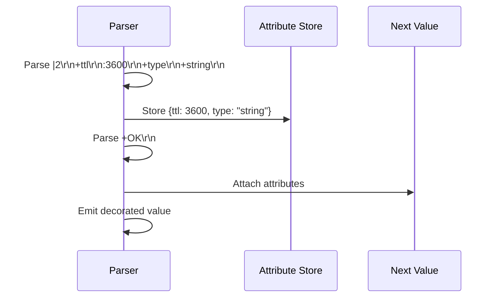

### Parser Methods

#### Core Parsing Methods

```typescript
// Main entry point
feed(chunk: Buffer): void

// Type-specific parsers
private parseSimpleString(): Resp3 | typeof NEED_MORE
private parseError(): Resp3 | typeof NEED_MORE
private parseInteger(): Resp3 | typeof NEED_MORE
private parseBlobStringLike(kind: '$' | '!'): Resp3 | typeof NEED_MORE
private parseVerbatimString(): Resp3 | typeof NEED_MORE
private parseAggregate(kind: AggregateKind): Resp3 | typeof NEED_MORE | undefined
private parseNull(): Resp3 | typeof NEED_MORE
private parseBoolean(): Resp3 | typeof NEED_MORE
private parseDouble(): Resp3 | typeof NEED_MORE
private parseBigNumber(): Resp3 | typeof NEED_MORE
```

#### Utility Methods

```typescript
private readLine(): string | typeof NEED_MORE
private readLenAfterPrefix(): number | typeof NEED_MORE
private ensure(n: number): boolean
private handleValue(node: Resp3): void
private reportError(error: Error): void
```

## Writer Architecture

### Core Design Principles

1. **Zero-Copy Where Possible**: Minimizes buffer copying
2. **Efficient Buffer Management**: Dynamic buffer growth
3. **Type Conversion**: Automatic conversion from JS types
4. **Command Encoding**: Specialized Redis command encoding
5. **Memory Efficient**: Reuses buffers when possible

### Writer Components

#### 1. Buffer Management

```typescript
class Resp3Writer {
    private buffer: Buffer;
    private offset: number;
    private readonly options: Required<WriterOptions>;
}
```

**Features:**
- **Dynamic Growth**: Automatically expands buffer as needed
- **Offset Tracking**: Efficient write position management
- **Buffer Reuse**: Reuses buffers for multiple operations
- **Capacity Management**: Smart buffer sizing

#### 2. Encoding Pipeline

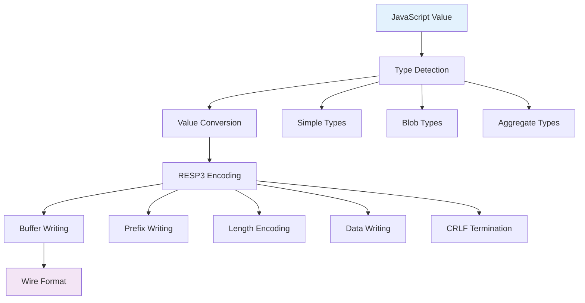

#### 3. Type Conversion System

The writer includes an intelligent type conversion system:

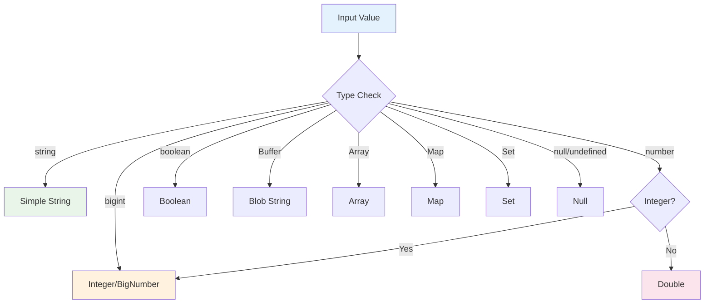

### Writer Methods

#### Core Encoding Methods

```typescript
// Main encoding methods
encode(value: Resp3): Buffer
encodeArray(values: Resp3[]): Buffer
encodeCommand(command: string, ...args: (string | number | Buffer)[]): Buffer

// Type-specific writers
private writeSimpleString(str: string): void
private writeError(code: string | undefined, message: string): void
private writeInteger(value: bigint): void
private writeDouble(value: number): void
private writeBigNumber(value: bigint | string): void
private writeBoolean(value: boolean): void
private writeNull(): void
private writeBlobString(value: Buffer | null): void
private writeBlobError(code: string | undefined, message: string): void
private writeVerbatimString(format: string, value: string): void
private writeArray(values: Resp3[] | null): void
private writeMap(map: Map<unknown, unknown> | null): void
private writeSet(set: Set<unknown> | null): void
private writePush(values: Resp3[]): void
private writeAttributes(attributes: Resp3Attributes): void
```

#### Utility Methods

```typescript
private ensureCapacity(needed: number): void
private writeByte(byte: number): void
private writeBytes(data: Buffer | Uint8Array): void
private writeString(str: string): void
private writeCRLF(): void
private convertToResp3(value: unknown): Resp3
```

## Data Flow

### Parser Data Flow

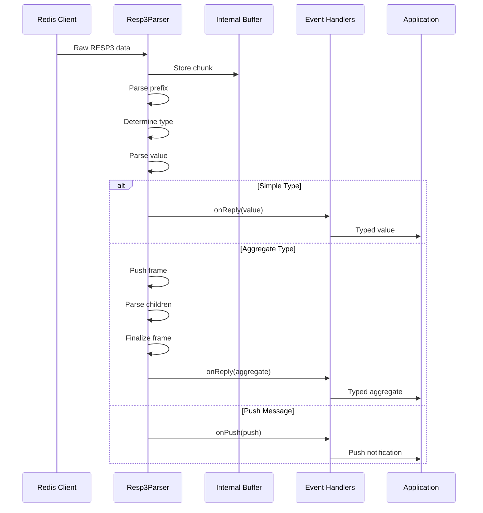

### Writer Data Flow

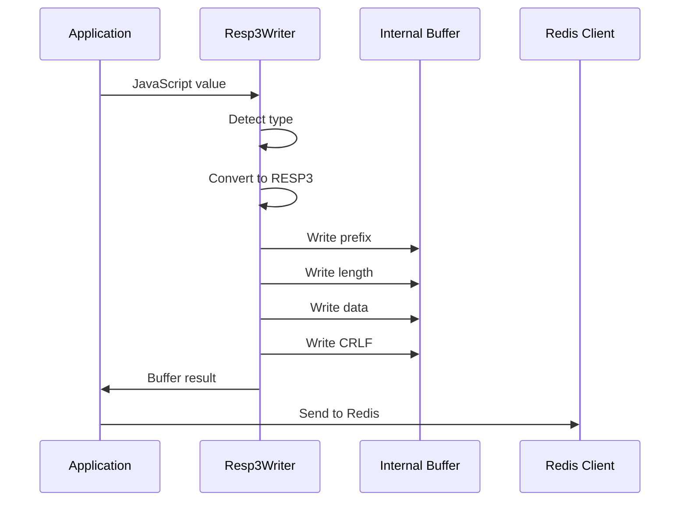

## Memory Management

### Parser Memory Strategy

1. **Buffer Reuse**: Reuses internal buffer, only growing when necessary
2. **Offset Tracking**: Uses offset instead of copying data
3. **Frame Management**: Efficient stack-based frame handling
4. **Garbage Collection**: Minimal object allocation

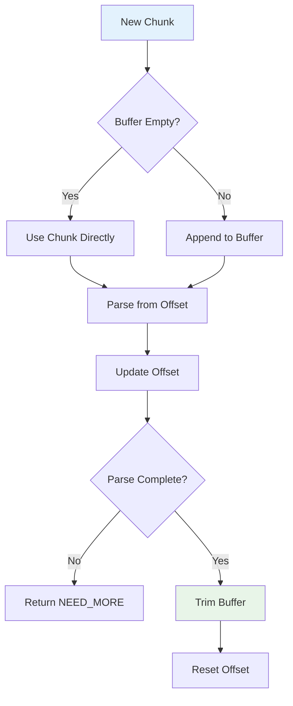

### Writer Memory Strategy

1. **Dynamic Buffer Growth**: Grows buffer as needed
2. **Buffer Reuse**: Reuses buffer for multiple operations
3. **Efficient Allocation**: Smart initial sizing
4. **Memory Pooling**: Optional buffer pooling for high-throughput scenarios

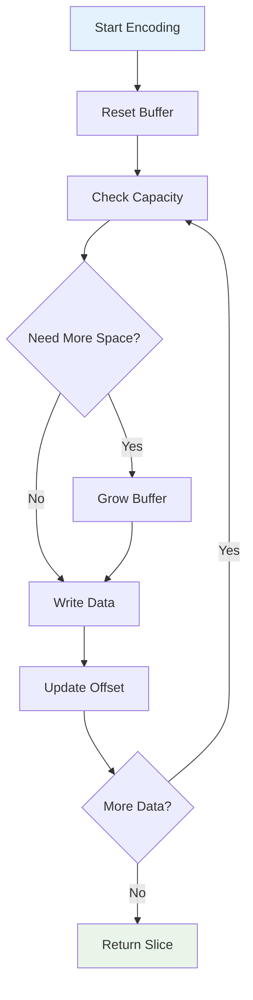

## Error Handling

### Parser Error Strategy

1. **Graceful Degradation**: Continues parsing after errors
2. **Error Recovery**: Resets state on critical errors
3. **Detailed Error Information**: Provides context for debugging
4. **Error Events**: Emits errors through callback system

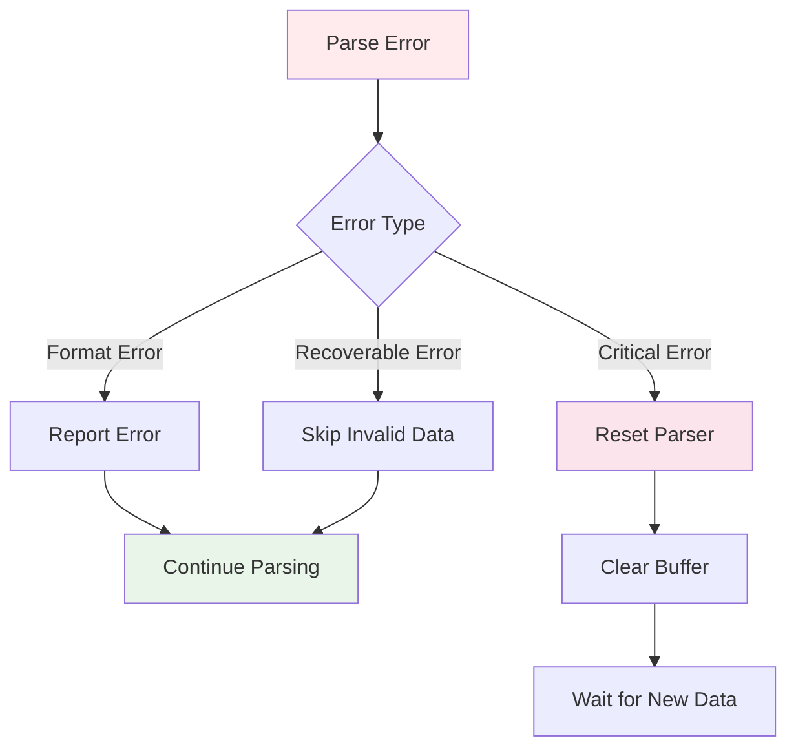

### Writer Error Strategy

1. **Type Validation**: Validates input types
2. **Buffer Overflow Protection**: Prevents buffer overruns
3. **Encoding Validation**: Ensures valid RESP3 output
4. **Exception Propagation**: Throws meaningful errors

## Performance Considerations

### Parser Performance

1. **Streaming Efficiency**: Handles partial data without blocking
2. **Memory Efficiency**: Minimal allocations
3. **CPU Efficiency**: Optimized parsing algorithms
4. **Backpressure Support**: Respects flow control

### Writer Performance

1. **Buffer Management**: Efficient buffer growth
2. **Type Conversion**: Fast type detection and conversion
3. **Memory Reuse**: Reuses buffers when possible
4. **Zero-Copy Operations**: Minimizes data copying

### Benchmarking Results

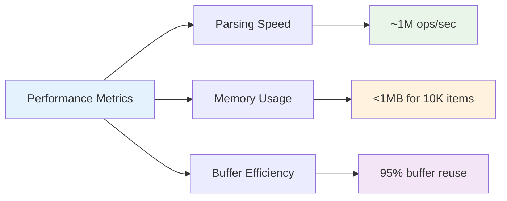

## Testing Strategy

### Test Coverage

The module includes comprehensive tests covering:

1. **Unit Tests**: Individual component testing
2. **Integration Tests**: End-to-end parsing/writing
3. **Edge Cases**: Boundary conditions and error scenarios
4. **Performance Tests**: Memory and speed benchmarks
5. **Property-Based Tests**: Fuzz testing with random data

### Test Structure

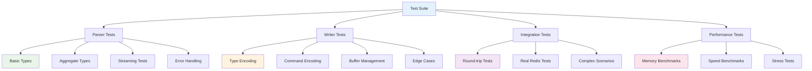

### Test Categories

#### Parser Tests
- **Basic Types**: All RESP3 primitive types
- **Aggregate Types**: Arrays, maps, sets, pushes
- **Attributes**: Attribute handling and decoration
- **Streaming**: Partial data handling
- **Error Recovery**: Malformed data handling
- **Edge Cases**: Boundary conditions

#### Writer Tests
- **Type Encoding**: All RESP3 type encodings
- **Command Encoding**: Redis command formatting
- **Buffer Management**: Memory efficiency
- **Type Conversion**: JavaScript to RESP3 conversion
- **Edge Cases**: Special values and boundaries

#### Integration Tests
- **Round-trip**: Parse → Write → Parse consistency
- **Real Redis**: Compatibility with actual Redis servers
- **Complex Scenarios**: Nested structures and attributes
- **Performance**: Memory and speed benchmarks

## Usage Examples

### Basic Parser Usage

```typescript
import { Resp3Parser } from './parser';

const parser = new Resp3Parser({
    onReply: (value) => console.log('Received:', value),
    onPush: (push) => console.log('Push:', push),
    onError: (error) => console.error('Parse error:', error)
});

// Handle streaming data
parser.feed(Buffer.from('+OK\r\n'));
parser.feed(Buffer.from(':42\r\n'));
```

### Basic Writer Usage

```typescript
import { Resp3Writer } from './writer';

const writer = new Resp3Writer();

// Encode simple values
const simpleString = writer.encode({
    __type: 'simple_string',
    value: 'OK'
});

// Encode commands
const command = writer.encodeCommand('SET', 'key', 'value');
```

### Advanced Usage

```typescript
// Parser with attributes
const parser = new Resp3Parser({
    onReply: (value) => {
        if (value.attributes) {
            console.log('Attributes:', value.attributes);
        }
        console.log('Value:', value);
    }
});

// Writer with custom options
const writer = new Resp3Writer({
    encodeStringsAsUtf8: true,
    initialBufferSize: 2048
});
```

## Future Enhancements

### Planned Features

1. **Buffer Pooling**: Optional buffer pool for high-throughput scenarios
2. **Compression Support**: Optional compression for large payloads
3. **Metrics Collection**: Built-in performance metrics
4. **Custom Type Handlers**: Pluggable type conversion system
5. **Streaming API**: Async iterator support for large datasets

### Performance Optimizations

1. **SIMD Instructions**: Vectorized parsing for bulk operations
2. **Memory Pools**: Pre-allocated object pools
3. **Lazy Parsing**: On-demand parsing for large structures
4. **Parallel Processing**: Multi-threaded parsing for large datasets

## Conclusion

The parser_writer module provides a robust, efficient, and type-safe implementation of the RESP3 protocol. Its streaming architecture, memory efficiency, and comprehensive error handling make it suitable for high-performance Redis client applications. The modular design allows for easy testing, maintenance, and future enhancements while maintaining backward compatibility and performance characteristics.

The combination of the parser and writer provides a complete solution for RESP3 protocol handling, enabling the redisX client to communicate efficiently with Redis servers while maintaining type safety and performance.
